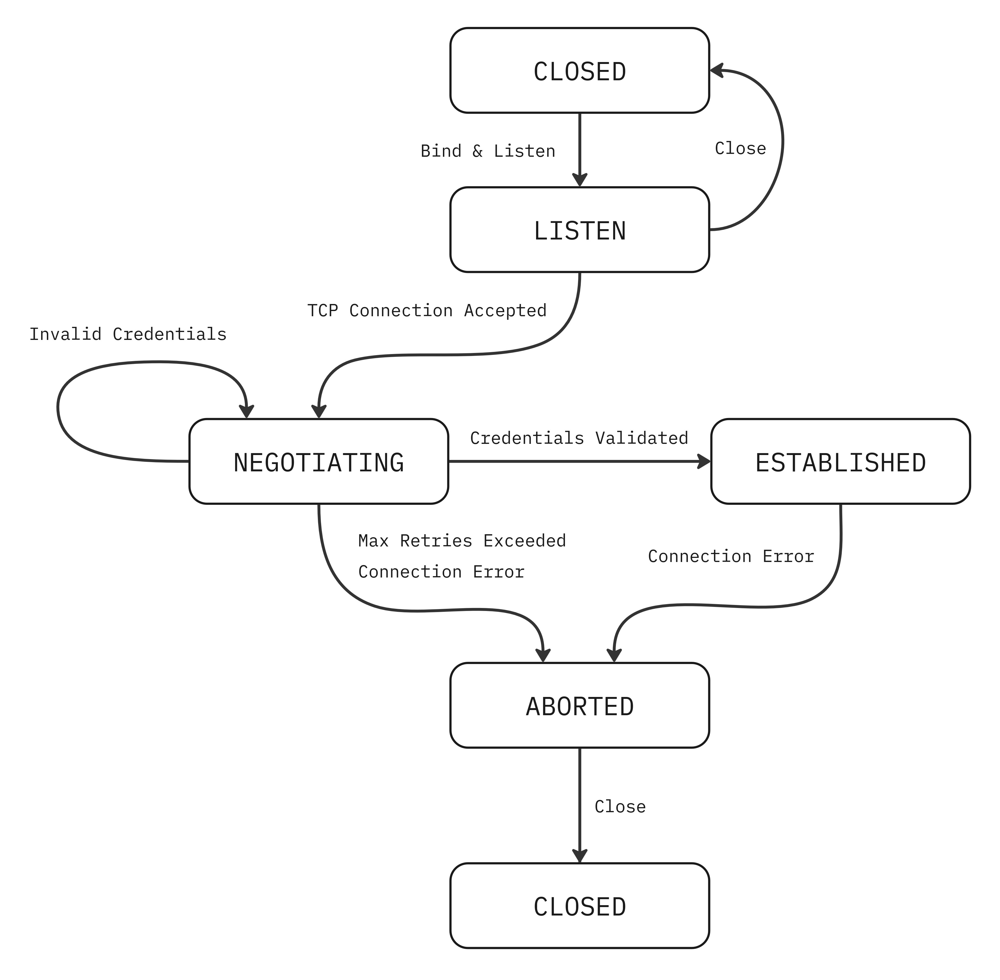

# Connection Lifecycle (State Machine)

The following state machine defines the operational lifecycle of a connection within the XSCP protocol from the server's perspective. This architecture ensures a robust handling of resources by strictly separating the transport layer connections from the application layer authentication.

  

## 1. State Definitions

* **`CLOSED`**: The initial and final state. No network resources are allocated, and the connection does not exist or has been fully terminated.
* **`LISTEN`**: The server socket is bound to a port and actively waiting for incoming TCP connections.
* **`NEGOTIATING`**: A temporary phase reached immediately after a successful TCP handshake. The server waits for the client to provide a valid identity (nickname) before allowing full protocol interaction.
* **`ESTABLISHED`**: The active communication state. The client is successfully identified, and the stream is fully open for processing requests and broadcasting notifications.
* **`ABORTED`**: A transitional sink state reached due to protocol violations, network errors, or authentication failures. It guarantees that emergency cleanup (like memory freeing and socket dropping) is performed before releasing the session back to `CLOSED`.

## 2. Events and Transitions

State transitions are triggered by network events, client inputs, or internal server conditions. 

| Source State | Destination State | Trigger Event | Description |
| :--- | :--- | :--- | :--- |
| **`CLOSED`** | **`LISTEN`** | `bind_and_listen` | The server initializes and binds to the specified port. |
| **`LISTEN`** | **`NEGOTIATING`** | `tcp_connection_accepted` | The OS completes the 3-way handshake; a dedicated handler is spawned. |
| **`LISTEN`** | **`CLOSED`** | `close` | The server shuts down the listener voluntarily. |
| **`NEGOTIATING`** | **`ESTABLISHED`** | `credentials_validated` | The client provides a unique, valid nickname conforming to XSCP rules. |
| **`NEGOTIATING`** | **`NEGOTIATING`** | `invalid_credentials` | The nickname is malformed or already in use. The retry counter increments. |
| **`NEGOTIATING`** | **`ABORTED`** | `max_retries_exceeded` | The client fails to provide valid credentials within the allowed attempts. |
| **`NEGOTIATING`** | **`ABORTED`** | `connection_error` | The connection is dropped or times out during the negotiation phase. |
| **`ESTABLISHED`** | **`ABORTED`** | `connection_error` | A protocol violation (e.g., PDU > 512 bytes) or an unexpected network disconnection occurs. |
| **`ABORTED`** | **`CLOSED`** | `close` | Internal cleanup finishes, and the file descriptor is fully released. |

## 3. Security and Retry Policy

To mitigate brute-force attacks, resource exhaustion, and "phantom" connections, XSCP enforces a strict lifecycle validation during the `NEGOTIATING` phase:

1. Clients are granted a limited number of attempts to submit a valid identity.
2. Each `invalid_credentials` event loops back to `NEGOTIATING` and increments an internal counter.
3. Once the limit is reached, the `max_retries_exceeded` event forces the connection into `ABORTED`, dropping the client immediately without allocating further memory.